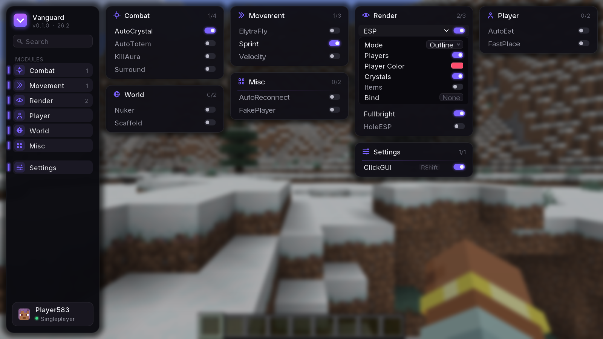

# Vanguard

A Fabric utility client for anarchy servers, built for **Minecraft 26.2** (the version 2b2t runs).



## Status

The foundation and the **ClickGUI** are done:

- A docked sidebar that works as a tab manager. Each category tab opens or closes its panel, and the Settings tab holds the ClickGUI's own options. The sidebar also has search, how many modules are on in each category, and your skin, name and server
- Open panels arrange themselves in a grid beside the sidebar and glide into place as tabs open and close. The whole area scrolls when it overflows
- Module rows with an on/off switch, the bound key, and a settings arrow that appears on hover. Settings open in an inset card
- A settings widget for every setting type: toggle switch, slider, mode dropdown, color picker (saturation/value, hue, alpha, copy/paste hex) and keybind
- Settings that only show when relevant (for example, Render Color only while Render is on)
- Module search: start typing anywhere. Only categories with a match stay open until you clear it
- Custom anti-aliased rendering for rounded shapes, soft shadows and line icons, plus the bundled Inter font (or Minecraft's font)
- Its own scale setting, so the menu looks the same at any Minecraft GUI scale
- Accent color or rainbow, background blur and dim, adjustable animation speed, hover descriptions
- A module/setting framework and a JSON config (`.minecraft/vanguard/config.json`), which also remembers open tabs and expanded modules

The combat, movement and render modules are **placeholders**: they declare their settings so the GUI has real content, but they don't do anything yet.

## Controls

| Action | Input |
| --- | --- |
| Open or close the ClickGUI | Right Shift (the ClickGUI's own bind) |
| Open or close a category | Click its tab in the sidebar, or the × on a panel's header |
| Toggle a module | Click its row |
| Show a module's settings | Click the arrow that appears on hover, or right-click the row |
| Search | Type; Escape clears, then closes |
| Scroll | Mouse wheel over the panels |
| Reset a slider or color | Right-click it |
| Bind a key | Click the bind box, press a key (Backspace or Delete to unbind, Escape to cancel) |

## Building

You need a JDK 21 or newer to start Gradle. Gradle downloads JDK 25 on its own, since Minecraft 26.2 and Loom need it.

```sh
./gradlew build        # jar in build/libs/
./gradlew test         # unit tests
./gradlew runClient    # dev client with the mod loaded
```

The jar bundles the two Fabric API modules it needs (`fabric-api-base` and `fabric-resource-loader-v1`), so you only need Fabric Loader installed to use it.

## Layout

```
src/main/java/dev/vanguard/
  Vanguard.java              entrypoint and singletons
  module/                    Module, Category, ModuleManager, module classes
  setting/                   Bool, Number, Enum, Color and Keybind settings
  config/                    JSON persistence
  gui/render/                Render2D, the shape pipeline and shader glue, icons, colors
  gui/anim/                  time-based animations and easing curves
  gui/clickgui/              screen, sidebar, panels, module rows, search, theme
  gui/clickgui/widget/       one widget per setting type
  mixin/                     keyboard hook for module binds
src/main/resources/assets/vanguard/
  shaders/core/shape.*       anti-aliased rounded shapes and soft shadows
  font/                      Inter (SIL OFL 1.1, see inter-license.txt)
```

### How rendering works

Minecraft 26.2 builds the GUI as a list of render states and draws them later, layered by their screen bounds. `Render2D` adds its own `GuiElementRenderState`s that use the `vanguard:pipeline/shape` pipeline. Rounded corners are quarter-circle quads, so the fragment shader only has to measure distance from the corner to get anti-aliased edges, rings and shadow falloff. The shape type and its parameter are packed into the texture coordinates, which lets every shape share one vertex format and batch together.
